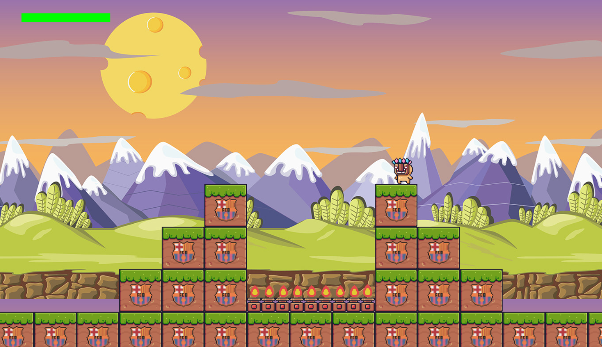
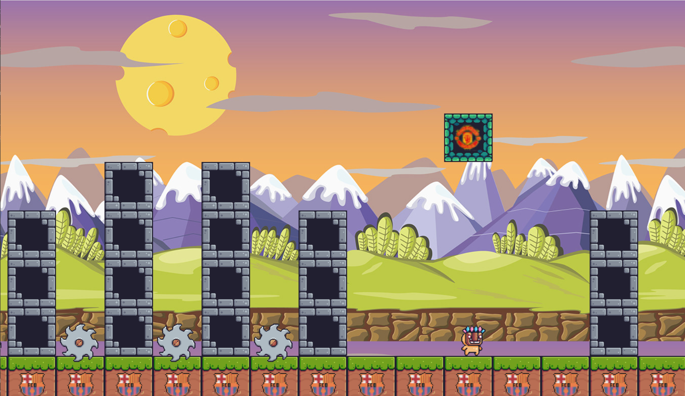

# 🎮 Simple 2D Mario-like Game

Sebuah game platformer 2D sederhana yang terinspirasi dari seri klasik Mario, dikembangkan menggunakan bahasa Python dengan bantuan library **Pygame**.

Dalam game ini, pemain mengendalikan sebuah karakter yang harus berlari, melompat, dan melewati berbagai rintangan dalam sebuah level side-scrolling. Tujuan utama dari permainan ini adalah mencapai akhir level dengan selamat sambil menghindari jebakan, musuh, dan jurang.

---

### 🎯 Tujuan Permainan
Bertahan hidup dan menyelesaikan level dengan melewati semua rintangan. Kecepatan, ketepatan, dan refleks yang baik akan sangat menentukan keberhasilan pemain.

---

### 🖼️ Screenshot

---

### 👥 Credit
- Darrell Chesta Adabi  
- Muhammad Dhafin Basil
- Muhammad Isa Arseinche
- Sahrul Ridho Firdaus
